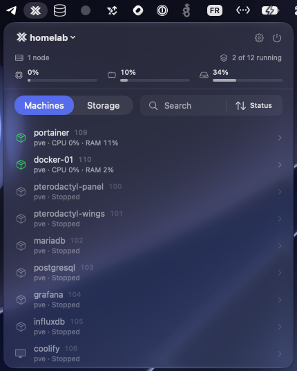
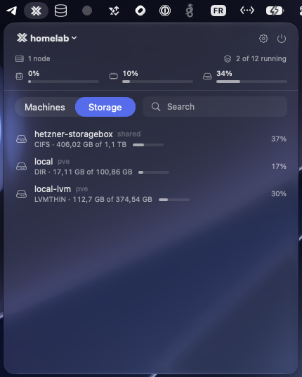

# ProxmoxBar

Native macOS menu bar app for monitoring and controlling Proxmox VE.

[](https://apps.apple.com/app/proxmoxbar/id6800746122)
[](https://www.apple.com/macos)
[](https://www.swift.org/)

<p align="center">
  
  &nbsp;
  
</p>

## Features

- Several servers, switched from the panel
- Nodes online, aggregated CPU, memory and storage at a glance
- Every VM and container with its live status, refreshed every five seconds, searchable and sortable
- A storage tab beside the machines, with per-datastore usage
- Start, shutdown, reboot, stop and resume, with the real task followed to completion
- Notifications when a machine or a node changes state, across every server
- Desktop and Notification Center widgets for any server, small or medium
- Menu bar title showing the icon alone, running machines, or cluster CPU
- Signed and notarized updates delivered by Sparkle

## Requirements

- macOS 15 or later
- A Proxmox VE server and an API token

On first connection macOS asks for permission to reach devices on your local
network. ProxmoxBar cannot see your server until you allow it. The prompt can be
revisited in System Settings, Privacy & Security, Local Network.

## Install

### Mac App Store

[Download on the Mac App Store](https://apps.apple.com/app/proxmoxbar/id6800746122).

### Homebrew

```
brew install --cask ryzenixx/tap/proxmoxbar
```

### Direct download

1. Open the [latest release](https://github.com/ryzenixx/proxmoxbar-macos/releases/latest).
2. Download `ProxmoxBar.dmg`.
3. Drag `ProxmoxBar.app` to `/Applications`.
4. Launch ProxmoxBar and add your server.

## Create a restricted API token

ProxmoxBar never needs your Proxmox password. Give it a token that can do only
what the app actually does, and nothing more.

### 1. Create a role

**Datacenter** → **Permissions** → **Roles** → **Create**.

- Name: `ProxmoxBar`
- Privileges:

| Privilege | What it allows the app to do |
| --------- | ---------------------------- |
| `VM.Audit` | Read the list of VMs and containers and their status |
| `VM.PowerMgmt` | Start, shutdown, reboot, stop and resume them |
| `Sys.Audit` | Read node status, for the online count and the CPU meter |
| `Datastore.Audit` | Read storage capacity for the summary row |

Nothing else is required. The app never touches pools, SDN, the console, or any
configuration.

### 2. Create a user

**Datacenter** → **Permissions** → **Users** → **Add**.

- User name: `proxmoxbar`
- Realm: `Proxmox VE authentication server`
- Password: a strong one, which the app never uses

### 3. Assign the role

**Datacenter** → **Permissions** → **Add** → **User Permission**.

- Path: `/`
- User: `proxmoxbar`
- Role: `ProxmoxBar`
- Propagate: checked

### 4. Create the token

**Datacenter** → **Permissions** → **API Tokens** → **Add**.

- User: `proxmoxbar@pve`
- Token ID: `menubar`, or any name you prefer
- Privilege Separation: unchecked
- Copy the secret now. Proxmox shows it once and never again.

Unchecking privilege separation gives the token the same rights as its user, and
that user only holds the four privileges above. Separation matters when a token
belongs to a powerful account; here there is nothing extra to separate from.

Paste the address, the token ID and the secret into ProxmoxBar. The secret goes
straight to the macOS keychain and is never written anywhere else.

## Self-signed certificates

Most homelab servers present a certificate macOS does not trust. ProxmoxBar shows
you the fingerprint and asks. Once you accept, that exact certificate is pinned:
if it ever changes, the connection is refused rather than trusted quietly.

## Build from source

```
git clone https://github.com/ryzenixx/proxmoxbar-macos.git
cd proxmoxbar-macos
open ProxmoxBar.xcodeproj
```

Select the `ProxmoxBar` scheme, then `Cmd+R`. Xcode 27 or later; dependencies are
resolved by Swift Package Manager on first open. The updater stays disabled in
Debug builds, so running from Xcode will not offer to replace your installed copy.

## Contributing

Bug reports, feature requests and pull requests are welcome. See
[CONTRIBUTING.md](CONTRIBUTING.md).

Security vulnerabilities go through
[private reporting](https://github.com/ryzenixx/proxmoxbar-macos/security/advisories/new),
never a public issue. See [SECURITY.md](.github/SECURITY.md).

## License

MIT. See [LICENSE](LICENSE).
